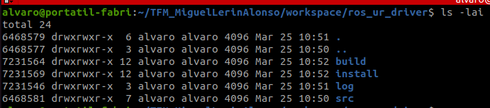

# Instalación del repositorio 
Este artículo se pretende ser una guía paso a paso del proceso de instalación del repositorio.

## Requisitos previos
Recuerde que para que el repositorio pueda funcionar correctamente, antes debe tener instalados:

1. Una versión de ROS2. Este repositorio se toma como referencia [ROS2 Humble](https://docs.ros.org/en/humble/Installation.html). Para otras versiones consulte la documentación oficial.
2. Una versión de Moveit compatible con su versión de ROS2. En este proyecto se descargó la [compatible con ROS2 Humble](https://moveit.picknik.ai/humble/index.html).
3. Una copia del [controlador de UR para ROS2](https://github.com/UniversalRobots/Universal_Robots_ROS2_Driver). Se usó la desarrollada para ROS2 Humble.

## Instalación automática
Para poder instalar el repositorio y ponerlo en funcionamiento de forma automática puede optar por ejecutar este código de bash desde su terminal.

````bash
source /opt/ros/humble/setup.bash
git clone -b main https://github.com/Miguel-LA/TFM_MiguelLerinAlonso.git
cd ./TFM_MiguelLerinAlonso/workspace/ros_ur_driver/
vcs import src --skip-existing --input src/Universal_Robots_ROS2_Driver/Universal_Robots_ROS2_Driver-not-released.${ROS_DISTRO}.repos
rosdep update
rosdep install --ignore-src --from-paths src -y
colcon build --cmake-args -DCMAKE_BUILD_TYPE=Release
source install/setup.bash

REPO_DIR=$(pwd)

echo "source /opt/ros/humble/setup.bash" >> ~/.bashrc
echo "source $REPO_DIR/install/setup.bash" >> ~/.bashrc
````

En la siguiente sección se explica el proceso de instalación del repositorio paso a paso.

## Instalación paso a paso
Puede desplazarse al directorio donde desea almacenar el repositorio y comenzar con la instalación paso a paso:

Haga un source previo de su versión de ROS2 instalada.

````bash
source /opt/ros/humble/setup.bash
````

Clone el repositorio en la carpeta seleccionada y moverse dentro del directorio que almacena los controladores de UR `ros_ur_driver`.

````bash
git clone -b main https://github.com/Miguel-LA/TFM_MiguelLerinAlonso.git
cd ./TFM_MiguelLerinAlonso/workspace/ros_ur_driver/
````

En este fragmento de código se descarga una copia de la rama `main` con las instrucciones `-b main`. Si desea descargar otra rama recuerde cambiar las instrucciones por la forma `-b <nombre_rama>`

> **IMPORTANTE**
>
> En el ejemplo se está optando por la opción de clonación mediante protocolo HTPPS. Si lo desea también puede utilizar Github para emplear otros protocolos como:
> A. SSH:
> ```bash
> git clone git@github.com:Miguel-LA/TFM_MiguelLerinAlonso.git
> ```
> B. GitHub CLI:
> ```bash
> gh repo clone Miguel-LA/TFM_MiguelLerinAlonso
> ```

Importe y actualice los archivos del controlador de UR para ROS2 dentro de la carpeta `src` del repositorio para solucionar problemas de compatibilidad.

```bash
vcs import src --skip-existing --input src/Universal_Robots_ROS2_Driver/Universal_Robots_ROS2_Driver-not-released.${ROS_DISTRO}.repos
```
El flag `--skip-existing` se utiliza para leer en nuestro equipo aquellos archivos del controlador que ya se encuentran instalados y actualizados, evitando realizar instalaciones duplicadas. El flag `--input` se utiliza para tomar como referencia de datos de entrada, la copia disponible en la raíz del repositorio.

Se actualiza la versión de ROS2 instalada verificando la compatibilidad entre versiones. Con los flags `--ignore-src --from-paths src -y` se indica que se deben ignorar automáticamente los archivos de ROS2 del directorio src (los propios del repositorio) para evitar conflictos

```bash
rosdep update
rosdep install --ignore-src --from-paths src -y
```
Se compila la instalación del repositorio para que pueda montar la estructura de ROS2 con la instrucción `colcon build`. A continuación se vuelve a hacer un source para asegurar que el espacio de trabajo queda bien configurado.

```bash
colcon build --cmake-args -DCMAKE_BUILD_TYPE=Release
source install/setup.bash
```
Recordar que se debe hacer `colcon build` desde el directorio `ros_ur_driver`. Si se ha hecho de forma correcta encontrará un aspecto como el siguiente:


La carpeta src deberá contener únicamente todos los paquetes ROS2 del repositorio.

### Solución de errores
Es posible que durante la primera compilación del paquete con `colcon buil` le aparezca un error de salida como el del ejemplo:

```bash
--- stderr: ur_moveit_config                                                                             
CMake Error: The current CMakeCache.txt directory /home/alvaro/Desktop/pruebas_repo_TFM/TFM_MiguelLerinAlonso/workspace/ros_ur_driver/build/ur_moveit_config/CMakeCache.txt is different than the directory /home/alvaro/TFM_MiguelLerinAlonso/workspace/ros_ur_driver/build/ur_moveit_config where CMakeCache.txt was created. This may result in binaries being created in the wrong place. If you are not sure, reedit the CMakeCache.txt
---
```

Compruebe que puede lanzar los archivos de conexionado con el robot o el de simulación. En caso de ser así, vuelva a ejecutar `colcon build` y ya se completará la instalación sin otros problemas. 

En caso de continuar con problemas, se recomienda revisar su versiones de ROS2, Moveit y el controlador de UR para ROS2. A continuación, volver a intentarlo siguiendo las instrucciones del manual.

### Sourceo automático del espacio de trabajo
Para evitar estar haciendo un source explícito cada vez que se inicie una instancia del espacio de trabajo, se puede almacenar su dirección en el directorio `~/.bashrc`. 

Desde la carpeta del repositorio instalado (`~/TFM_MiguelLerinAlonso/workspace/ros_ur_driver/`) guarde la dirección absoluta de su ubicación en una variable de entorno.

```bash
REPO_DIR=$(pwd)
```

Cargue la instrucción de source explícito en el directorio `~/.bashrc`.
```bash
echo "source /opt/ros/humble/setup.bash" >> ~/.bashrc
echo "source $REPO_DIR/install/setup.bash" >> ~/.bashrc
```